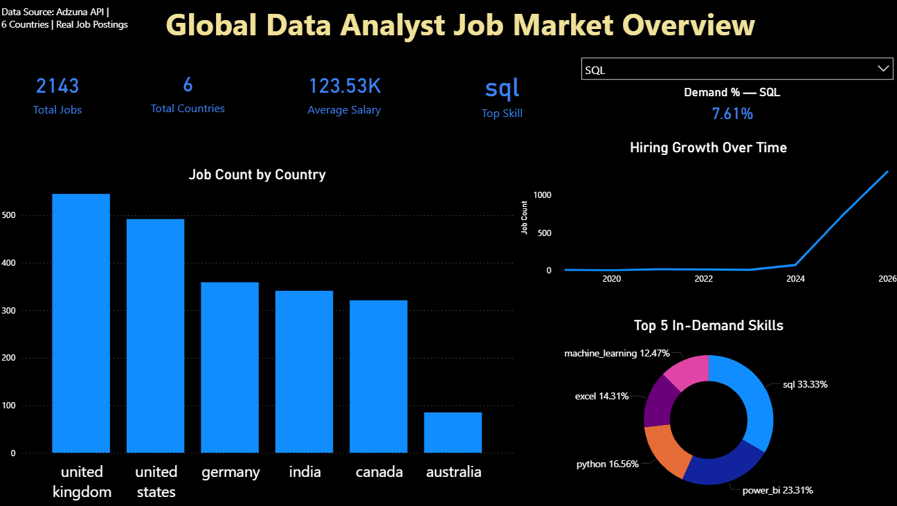
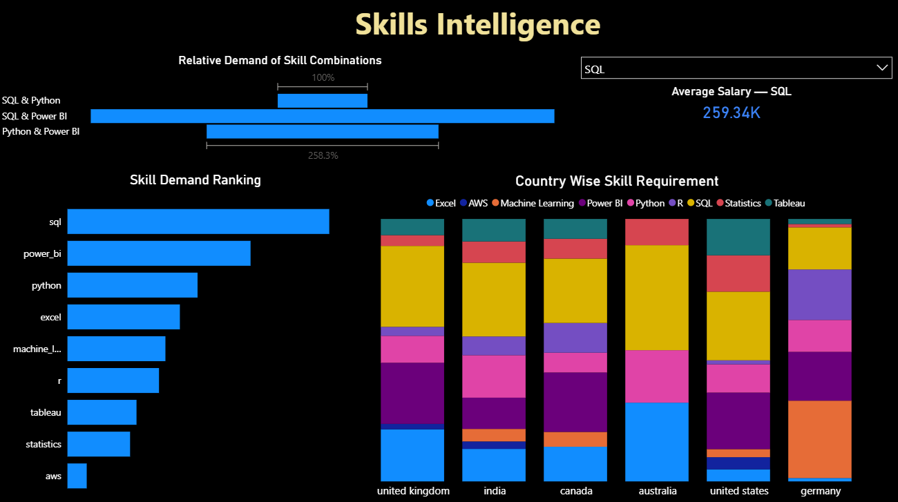
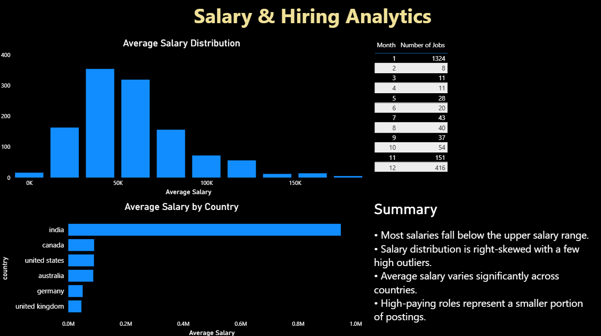

# Global Data Analyst Job Market Analytics

End-to-end analytics project analysing the global Data Analyst job market using real job postings from the Adzuna API.

This project covers the full analytics pipeline:

**API Ingestion → Data Cleaning → Feature Engineering → SQL Analytics → Power BI Dashboard**

---

## Project Goal

Analyze the global Data Analyst job market to understand:

- Skill demand
- Salary distribution
- Hiring trends
- Country-wise demand patterns

---

## Tech Stack

- Python
- Adzuna Job Search API
- MySQL
- Pandas
- SQL
- Power BI

---

## Data Pipeline

### 1. Data Ingestion
- Pulled real job postings from Adzuna API
- Multi-country scraping:
  - GB, IE, US, DE, CA, AU, IN
- Pagination supported
- Raw data stored in MySQL (`jobs_raw`)

### 2. Data Cleaning & Feature Engineering
- Filtered Data Analyst roles
- Parsed salary fields (min, max, average)
- Normalized country, city, and company fields
- Extracted skills using keyword matching:
  - Python, SQL, Power BI, Tableau, Excel, AWS, Machine Learning, Statistics, R
- Created:
  - `avg_salary`
  - binary skill columns (`has_sql`, `has_python`, etc.)

### 3. SQL Analytics Tables
Built aggregated analytics tables:

- `skill_demand_summary`
- `salary_by_country`
- `hiring_trends`
- `monthly_trends`

---

## Power BI Dashboard

### Page 1 — Global Market Overview
- KPI cards (total jobs, countries, average salary, top skill)
- Job count by country
- Monthly hiring trend
- Top skills snapshot

### Page 2 — Skills Intelligence
- Global skill demand ranking
- Skill distribution by country
- Skill combinations
- Dynamic salary by selected skill

### Page 3 — Salary Analytics
- Salary distribution
- Salary comparison by country
- Key salary insights summary

---

## Dashboard Preview

### Global Market Overview

### Skills Intelligence

### Salary Analytics

---

## Key Insights

- SQL is the most demanded skill globally.
- Hiring activity peaks strongly around January.
- Salary distribution is right-skewed with high-value outliers.
- Skill demand varies significantly across countries.

---

## Project Structure
